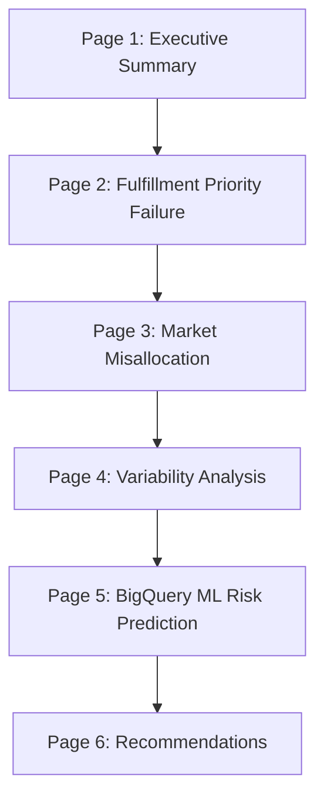

# Dashboard Copy and Metrics

This file is the working source for dashboard headlines, KPI callouts, and defensible impact language.

Use the logged chapter results as the source of truth.

## One-line thesis

> The network is value-blind rather than value-aware: high-profit orders are not meaningfully protected, market efficiency varies even when all markets remain profitable, and a small set of unstable lanes drives a concentrated share of SLA failures.

## Executive summary metrics

- **$2.77M profit at risk** in breached high-profit orders
- **40.67% of grouped SLA breaches** concentrated in the top 5 highest-variance market-mode combinations
- **0.741 ROC AUC** from the BigQuery ML breach-risk model on holdout data

## Impact formulas

### Profit at risk protected

Use when showing routing or SLA improvement scenarios.

Formula:

```text
profit_protected = high_value_profit_at_risk * improvement_rate
```

Base:

- `high_value_profit_at_risk = 2,770,884.62`

Scenario examples:

- 5% improvement = about **$138.5K** protected
- 10% improvement = about **$277K** protected
- 15% improvement = about **$415.6K** protected

### Breach concentration reduced

Use when discussing the variability chapter.

Formula:

```text
breach_share_reduced = 40.67% * improvement_rate
```

Scenario examples:

- 10% reduction in concentration = 4.07 percentage points lower concentrated breach share
- 25% reduction = about 10.17 percentage points lower concentrated breach share

### Market efficiency lift

Use for Europe vs Pacific Asia framing.

Observed gaps:

- Europe: **+1.64 pp** profit share above volume share
- Pacific Asia: **-1.24 pp** profit share below volume share

Use this as a portfolio-mix story, not as a direct savings claim.

### BigQuery ML prediction quality

Use for the final page and technical close.

Observed results:

- ROC AUC: **0.741**
- accuracy: **0.695**
- recall: **0.553**

Primary model drivers:

- `days_for_shipment_scheduled`
- `shipping_mode`
- `order_region`
- `market`

## Recommended dashboard page headlines

### Page 1

**The network is value-blind, not value-aware**

Subhead:

**$2.77M in high-value profit at risk, concentrated SLA failures, and uneven market efficiency**

### Page 2

**High-profit orders receive no meaningful fulfillment advantage**

Callout:

**Value-tier service levels are nearly flat, so high-value orders are not being protected differently**

### Page 3

**Europe over-converts volume into profit; Pacific Asia under-converts**

Callout:

**The market portfolio is profitable, but conversion efficiency varies**

### Page 4

**A small set of lanes drives a concentrated share of SLA failures**

Callout:

**Top 5 unstable market-mode combinations account for 40.67% of grouped breaches**

### Page 5

**BigQuery ML predicts breach risk**

Callout:

**The model reaches 0.741 ROC AUC, with service promise and shipping mode acting as the strongest breach-risk drivers**

### Page 6

**Three actions to protect value, rebalance mix, and stabilize the weakest lanes**

Callout:

**Focus on profit protection, portfolio efficiency, and variability control**

## Dashboard hierarchy



## Visual priority by page

### Page 1

- three KPI cards
- one thesis sentence
- one small trend line only

### Page 2

- profit quartile delay chart
- SLA breach rate by quartile
- high-value profit-at-risk callout

### Page 3

- volume share vs profit share comparison
- market efficiency ranking table
- profit-at-risk by market

### Page 4

- delay variability heatmap by market and shipping mode
- top-variance lanes table
- concentration callout with 40.67% figure

### Page 5

- model prediction summary
- feature importance or evaluation metrics
- top predicted-risk lane ranking

### Page 6

- three recommendation cards
- each card should use Problem → Action → Expected Impact


## Recommendation language

### 1. Value-based routing

**Problem:** High-profit orders have no meaningful fulfillment advantage.

**Action:** Route the highest-value orders into more consistent service tiers.

**Impact language:** Even a 10% reduction in breached high-value profit protects about **$277K**.

### 2. Portfolio rebalancing

**Problem:** Europe and Pacific Asia are not equally efficient.

**Action:** Shift capacity toward stronger-converting markets and away from weaker-converting lanes.

**Impact language:** Improve portfolio mix by reducing the gap between volume share and profit share.

### 3. Variability control

**Problem:** 40.67% of grouped breaches sit in the top 5 unstable lanes.

**Action:** Prioritize the most unstable market-mode combinations for consistency-first SLA handling.

**Impact language:** Reduce breach concentration in the lanes that contribute the most operational instability.

