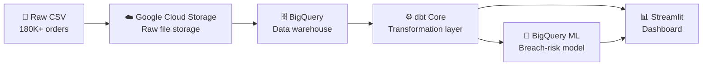
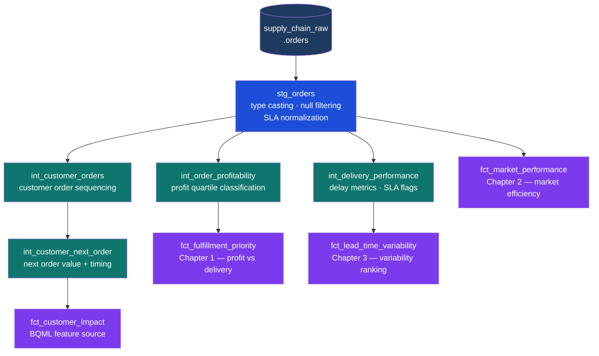

# Supply Chain Prioritization & Risk Analysis


> **$2.77M in high-value profit at risk. 40.67% of SLA breaches concentrated in 5 lanes. A machine learning model that predicts delivery failure before it happens.**

---

## The problem

Standard supply chain reporting focuses on averages — average delay, average SLA compliance, average profit per market. Averages hide the real problem.

This project answers a more useful question: **is the network treating high-value orders any differently from low-value ones, and where are reliability failures actually concentrated?**

The answer is no, and it is measurable.

---

## Key findings

| Metric | Value |
|---|---|
| High-value profit at risk | **$2.77M** |
| SLA breach concentration in top 5 lanes | **40.67%** |
| Europe profit-share lift above volume share | **+1.64 pp** |
| Pacific Asia profit-share gap below volume share | **−1.24 pp** |
| BigQuery ML breach-risk model ROC AUC | **0.741** |
| Model accuracy on holdout data | **69.5%** |
| Model recall on breached orders | **55.3%** |

---

## Dashboard

<!-- Add a screenshot of the Streamlit app here after deployment -->
<!-- Example:  -->

> **Live app:** *(deploy to Streamlit Community Cloud and add link here)*

---

## Pipeline architecture



---

## dbt model lineage



---

## Analytical story — four layers

### 1 — Fulfillment prioritization failure
The network is value-blind. High-profit orders breach SLA at nearly the same rate as low-profit ones, leaving **$2.77M** in top-quartile profit unnecessarily exposed.

### 2 — Market efficiency ranking
All markets are profitable, but they are not equally efficient. Europe converts volume into profit better than its size would suggest (+1.64 pp lift). Pacific Asia converts less (-1.24 pp gap). The mix can be improved without chasing new revenue.

### 3 — Variability is the hidden driver
Average delays look acceptable. Standard deviation tells a different story. **40.67% of all SLA breaches** cluster in just 5 market-mode combinations — the rest of the network is largely stable.

### 4 — BigQuery ML breach-risk prediction
Operational features (scheduled shipping days, shipping mode, market, region) are strong enough to predict SLA breach risk before an order ships. The model reaches **0.741 ROC AUC** on holdout data, with `days_for_shipment_scheduled` and `shipping_mode` as the dominant drivers.

---

## Recommendations

```
┌─────────────────────────────┬──────────────────────────────────────────────────────────────────┐
│ Action                      │ Expected impact                                                  │
├─────────────────────────────┼──────────────────────────────────────────────────────────────────┤
│ Value-based routing         │ 10% breach reduction in top-quartile orders protects ~$277K      │
│ Portfolio rebalancing       │ Shift capacity toward Europe-style efficiency, away from underperformers │
│ Variability control         │ Fixing top 5 lanes reduces network breach concentration by ~40%  │
│ ML early intervention       │ Model flags 55% of at-risk orders before dispatch                │
└─────────────────────────────┴──────────────────────────────────────────────────────────────────┘
```

---

## Project structure

```
supply-chain/
│
├── app.py                               ← Streamlit dashboard (6 pages)
├── requirements_streamlit.txt           ← app dependencies
├── README.md
│
├── exports/                             ← pre-exported data for the app
│   ├── fct_fulfillment_priority.csv     ← Chapter 1 mart (gitignored, regenerate via dbt)
│   ├── fct_market_performance.csv       ← Chapter 2 mart (gitignored, regenerate via dbt)
│   ├── fct_lead_time_variability.csv    ← Chapter 3 mart (gitignored, regenerate via dbt)
│   ├── bqml_evaluation.csv              ← model evaluation metrics
│   ├── bqml_feature_importance.csv      ← feature importance scores
│   └── bqml_top_risk_lanes.csv          ← top predicted-risk lane ranking
│
├── supply_chain_dbt/                    ← dbt project
│   ├── models/
│   │   ├── staging/                     ← stg_orders (type casting, cleaning)
│   │   ├── intermediate/                ← profitability, delivery, customer sequencing
│   │   └── marts/                       ← fct_fulfillment, fct_market, fct_variability
│   ├── dbt_project.yml
│   └── profiles.yml                     ← BigQuery connection config
│
├── analysis/                            ← query logs per chapter
│   ├── 01_chapter_fulfillment_prioritization.md
│   ├── 02_chapter_market_misallocation.md
│   ├── 03_chapter_variability.md
│   └── 04_chapter_bqml_prediction.md    ← BQML SQL, evaluation results, feature importance
│
├── scripts/
│   └── export_raw_to_csv.py             ← converts Excel to CSV for BigQuery load
│
└── sql/bigquery/
    └── 00_create_datasets.sql           ← BigQuery dataset setup DDL
```

---

## BigQuery ML model

```sql
CREATE OR REPLACE MODEL `supply_chain_analytics.sla_breach_risk_model`
OPTIONS(
  model_type = 'BOOSTED_TREE_CLASSIFIER',
  input_label_cols = ['label'],
  data_split_method = 'AUTO_SPLIT',
  enable_global_explain = TRUE
) AS
SELECT
  market, order_region, shipping_mode, customer_segment,
  category_name, department_name,
  order_item_total, order_item_discount_rate,
  order_item_profit_ratio, order_profit_per_order,
  CAST(days_for_shipment_scheduled AS FLOAT64) AS days_for_shipment_scheduled,
  CASE WHEN sla_breached = 'Yes' THEN 1 ELSE 0 END AS label
FROM `supply_chain_analytics.stg_orders`
WHERE sla_breached IN ('Yes', 'No');
```

**Evaluation results on holdout data:**

| Metric | Value |
|---|---|
| ROC AUC | **0.741** |
| Accuracy | **0.695** |
| Recall | **0.553** |
| F1 Score | 0.677 |

**Top feature drivers:**

| Feature | Importance gain |
|---|---|
| `days_for_shipment_scheduled` | 2132.75 |
| `shipping_mode` | 1942.70 |
| `order_region` | 3.49 |
| `market` | 3.37 |

---

## How to run locally

**1. Clone the repo**
```bash
git clone https://github.com/your-username/supply-chain-risk-analysis.git
cd supply-chain-risk-analysis
```

**2. Install dependencies**
```bash
pip install -r requirements_streamlit.txt
```

**3. Run the dashboard**
```bash
streamlit run app.py
```

The three BQML export CSVs are committed and the app reads from `exports/`. The mart CSVs are gitignored (large files) — regenerate them with dbt if needed.

**To rebuild the full pipeline:**
```bash
# Authenticate with GCP
gcloud auth application-default login

# Run dbt models
cd supply_chain_dbt
dbt run --profiles-dir .

# Export mart tables from BigQuery to exports/ as CSV
# Then run the BQML training script to regenerate the prediction exports
```

---

## Dataset

**DataCo Supply Chain Dataset** — publicly available on Kaggle
- 180,519 rows · 51 columns · global order and shipping data · 2018
- [Kaggle source](https://www.kaggle.com/datasets/shashwatwork/dataco-smart-supply-chain-for-big-data-analysis)

---

## Stack

| Layer | Tool |
|---|---|
| Raw storage | Google Cloud Storage |
| Data warehouse | BigQuery |
| Transformation | dbt Core |
| Machine learning | BigQuery ML |
| Dashboard | Streamlit + Plotly |
| Language | Python · SQL |
