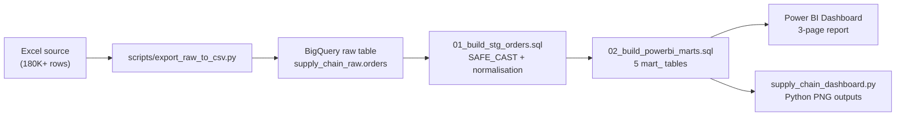

# Supply Chain SLA Risk & Profit Protection Analytics


> **The network is value-blind:** high-profit orders receive no service advantage, the shipping promise breaks at the mode level, and SLA failures concentrate in a handful of lanes.

This project analyzes **180,519 DataCo supply-chain orders** across five global markets to answer one operations question:

> *Which orders and lanes should operations prioritize to reduce SLA failures and protect profit?*

---

## Key Findings

| Finding | Result |
|---|---:|
| High-value profit at risk (Q1 orders, SLA breached) | **$2.77M** |
| Overall SLA breach rate | **57.3%** |
| Breach share concentrated in top 5 unstable lanes | **40.67%** |
| Europe profit-share lift above volume share | **+1.64 pp** |
| Pacific Asia profit-share gap below volume share | **-1.24 pp** |
| Second Class breach rate across all markets | **~80%** |

---

## Project Structure

```
supply-chain/
|-- README.md
|-- .gitignore
|
|-- sql/bigquery/                   # Full BigQuery transformation pipeline
|   |-- 00_create_datasets.sql      # Create raw + analytics datasets
|   |-- 00b_prepare_table_rebuild.sql
|   |-- 01_build_stg_orders.sql     # Staging: clean + type 40+ columns
|   |-- 02_build_powerbi_marts.sql  # Five analytics mart tables
|   |-- 03_validate_outputs.sql     # Row count + SLA flag QA checks
|   `-- 99_review_cleanup_old_objects.sql
|
|-- scripts/
|   |-- export_raw_to_csv.py        # Excel -> snake_case CSV for BigQuery load
|   `-- supply_chain_dashboard.py   # Python charts: exec summary + chapters + recs
|
|-- outputs/                        # Pre-rendered PNG visualizations
|   |-- output_exec_summary.png
|   |-- output_chapter_deepdives.png
|   `-- output_recommendations.png
|
|-- docs/
|   |-- SQL_POWERBI_GUIDE.md        # BigQuery -> Power BI connection guide
|   `-- powerbi_dax_measures.md     # All DAX measures used in the dashboard
|
`-- analysis/                       # Chapter-by-chapter evidence and SQL results
    |-- 01_chapter_fulfillment_prioritization.md
    |-- 02_chapter_market_misallocation.md
    `-- 03_chapter_variability.md
```

---

## Pipeline



---

## SQL — What It Demonstrates

The transformation pipeline is split across two scripts and is designed to be interview-explainable at every step.

**`01_build_stg_orders.sql` — Staging layer**
- `SAFE_CAST` on every column (defensive typing, no silent failures)
- `CASE` normalisation for boolean SLA flag across multiple source formats
- `WHERE` null-guard on three identity columns before downstream joins

**`02_build_powerbi_marts.sql` — Analytics layer**

| Technique | Where it appears |
|---|---|
| Multi-CTE architecture | All five marts |
| `NTILE(4)` profit quartiling | `mart_profit_priority`, `mart_executive_kpis` |
| `STDDEV_POP` delay variability | `mart_lane_reliability` |
| `RANK() OVER` | `mart_lane_reliability` — profit risk ranking |
| `SUM() OVER` share calculations | `mart_market_efficiency` — volume and profit share |
| `SAFE_DIVIDE` | All breach rate calculations |
| `COUNTIF` | Breach counts throughout |
| 2x2 lane classification | `mart_lane_reliability` — NTILE on 3 dimensions (profit risk, breach rate, variability) to assign Protect / Stabilize / Monitor / Maintain |

---

## Python — What It Demonstrates

**`scripts/export_raw_to_csv.py`**
- `pathlib` for OS-independent paths
- Explicit 51-column rename map with validation: raises `SystemExit` if Excel columns are missing or unexpected — catches schema drift before it hits BigQuery
- `__future__` annotations, type hints throughout
- ISO-8601 date formatting on export

**`scripts/supply_chain_dashboard.py`**
- `matplotlib` + `gridspec` for multi-panel layout
- Heatmaps (`imshow`), grouped bar charts, line charts, horizontal bars