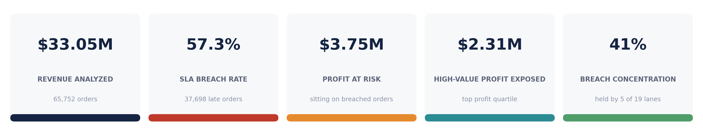
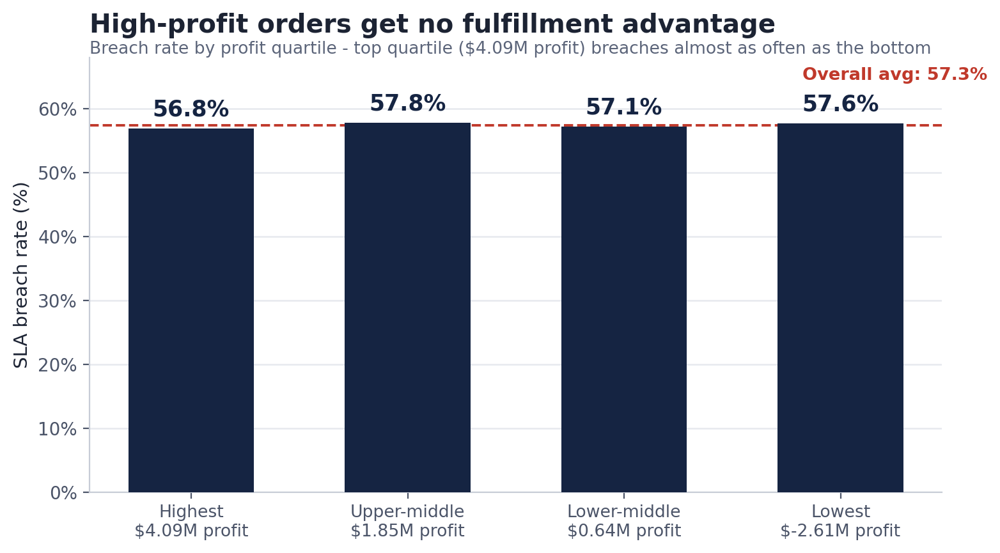
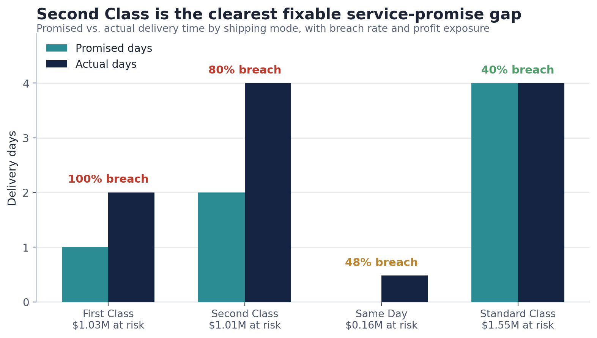
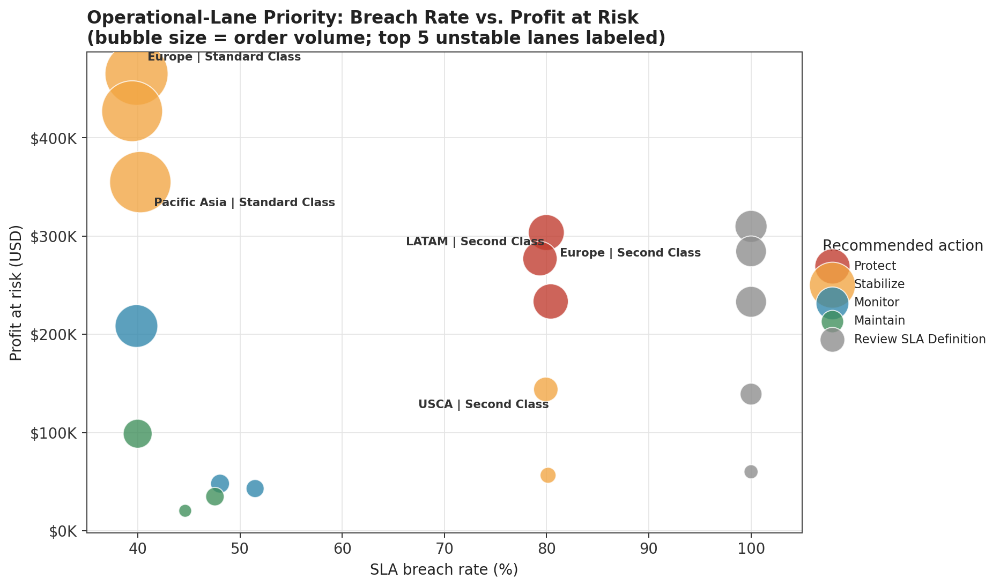
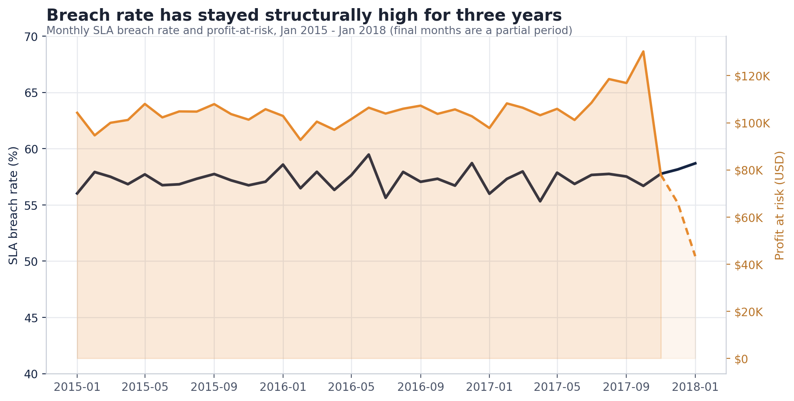
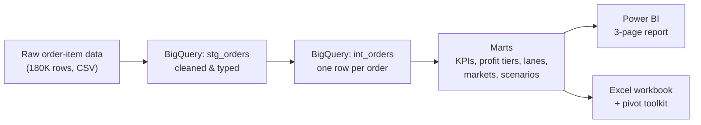
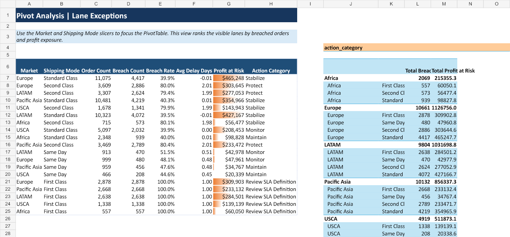

# Supply Chain Profit-at-Risk Analytics


**Which orders, shipping modes, and lanes should a fulfillment team fix first to protect the most profit?**

Over half of all orders in this network miss their delivery promise. That failure isn't evenly distributed — it's concentrated in specific shipping modes and lanes, and it hits high-profit orders exactly as often as low-profit ones. This project traces $33M in order revenue through a BigQuery data model to find where the failures are, how much profit sits behind them, and which fixes would recover the most value first.

*Dataset: public [DataCo Smart Supply Chain](https://data.mendeley.com/datasets/8gx2fvg2k6/5) (also on Kaggle), framed as a retailer's operational data. Portfolio project — not a live company deployment.*



**In short:** 57.3% of orders breach SLA · $3.75M profit sits on those breaches · five lanes hold 41% of the damage · three modeled pilots size the recovery path (not claimed savings).

---

## The problem

A retailer's fulfillment network is supposed to protect its most valuable orders first — in practice, this one doesn't. Every order, regardless of how much profit is riding on it, gets roughly the same one-in-two chance of arriving late. That's not just an operations issue; it's $3.75M in profit sitting on breached orders, $2.31M of it on the network's own highest-profit tier.

Three questions drive the analysis:

1. Does fulfillment protect high-profit orders more than low-profit ones? (No.)
2. Which shipping modes are breaking their own delivery promise, and by how much?
3. Where should a recovery effort start, given limited operational bandwidth?

## Key findings

**1. High-profit orders get no fulfillment advantage.** Orders were split into profit quartiles. If the network favored its best orders, the top quartile should breach noticeably less often. It doesn't — every quartile breaches within one point of the 57.3% average, including the top tier carrying $4.09M in profit.



**2. Second Class is the clearest, most fixable failure.** Every shipping mode was measured on what it promises against what it actually delivers. Second Class promises 2 days, takes 4, and breaches 79.9% of the time, carrying $1.01M in exposed profit. (First Class shows a 100% breach rate too, but that's a structural artifact of a 1-day promise the network can never technically meet — it's flagged separately, not counted as an operational failure.)



**3. Five lanes carry almost half the damage.** Every market x shipping-mode combination was ranked by breach rate, profit at risk, and delivery variability, then assigned an action: Protect, Stabilize, Monitor, Maintain, or Review SLA Definition. Five lanes — out of nineteen — account for 41% of all breaches network-wide.



**Is this new, or structural?** The breach rate has sat in the 55–65% band every month for three straight years. This isn't a bad quarter — it's how the network normally runs.



Full query-by-query walkthroughs (SQL, result, business read):

1. [Value-blind fulfillment](analysis/01_chapter_fulfillment_prioritization.md) — profit quartiles vs breach rate
2. [Market efficiency](analysis/02_chapter_market_misallocation.md) — where volume and profit diverge
3. [Service recovery & lane priority](analysis/03_chapter_variability.md) — shipping modes, lanes, and where to intervene

## Recommendations

These are modeled scenarios sized from the data, not realized savings — each one is scoped to a specific, testable pilot rather than a network-wide rollout.

| Priority | Recommendation | Scope | Modeled outcome |
|---|---|---|---|
| 1 | Cut Second Class delivery time by one day | 12,778 Second Class orders | 2,531 fewer breaches, ~$253K profit protected |
| 2 | Route top-profit-quartile Second Class orders onto a more reliable service tier | 3,159 orders | 1,256 avoidable breaches against a $627K exposure pool |
| 3 | Apply a 20% reliability improvement to the five highest-variability lanes | 30,150 orders | 3,097 fewer breaches, ~$309K profit protected |

Recommendation 1 is the narrowest, fastest pilot: one shipping mode, no routing changes. Recommendation 3 has the largest order volume in scope and directly targets the 41% breach concentration. Recommendation 2 carries the highest dollar exposure per order and is the most direct test of the value-blind finding above.

## How it was built



The source data is one row per *order item* — a single order can span several rows, and profit/revenue repeat across those rows. Summing naively overstates both. SQL in BigQuery collapses the data to one row per order (`SUM()`, not `MAX()`), then builds purpose-specific summary tables: one for executive KPIs, one for profit-tier analysis, one for lane reliability, and so on. Power BI, Excel, and this README all read from the same tables, so the numbers always agree.

**Methods that mattered**

- **Grain correction** — collapse item-level rows to one row per order before any profit or revenue rollup, so totals aren't double-counted
- **Promise vs delivery** — measure each shipping mode on scheduled days vs actual days, not breach rate alone
- **Structural vs operational failure** — treat First Class's impossible 1-day promise as a definition issue, separate from Second Class variability
- **Reconciled outputs** — `scripts/validate_exports.py` checks order counts, breaches, profit, exposure, and scenario caveats before charts or BI refresh

A companion Excel workbook adds a PivotTable with slicers, a carrier-delay sensitivity model, and a value-only exception export for teams that work outside BigQuery/Power BI:



## Explore without BigQuery

You don't need a GCP project to review the work:

| Open this | To do this |
|---|---|
| `Supply_Chain_Operational_Analysis.xlsx` | Read the management workbook (summary, lanes, scenarios, data dictionary) |
| `supply chain.pbix` | Open the 3-page Power BI report |
| `data/*.csv` | Inspect the same marts the charts and BI layer use |
| `analysis/` | Follow each finding from SQL → result → business read |

## What's in this repo

| Path | Contents |
|---|---|
| `Supply_Chain_Operational_Analysis.xlsx` | Management-ready workbook — Executive Summary, Profit Priority, Lanes, Markets, Customer Segments, Opportunity Scenarios, Data Dictionary |
| `supply chain.pbix` | The Power BI report (3 pages) |
| `sql/bigquery/` | Full transformation and validation SQL, numbered in run order |
| `data/` | Refreshed mart exports (CSV), one file per business question |
| `analysis/` | [Chapter write-ups](analysis/01_chapter_fulfillment_prioritization.md) with exact SQL, results, and business reads |
| `outputs/` | Chart images used in this README |
| `scripts/generate_visuals.py` | Regenerates every chart in this README from the mart CSVs |
| `scripts/validate_exports.py` | Reconciliation check for the checked-in mart exports |
| `docs/` | Power BI DAX measures and the SQL → Power BI build guide |

<details>
<summary><strong>Rebuild from scratch</strong></summary>

Project: `supply-chain-analysis-492322` · Dataset: `supply_chain_analytics`

```bash
bq query --use_legacy_sql=false < sql/bigquery/00_create_datasets.sql
bq query --use_legacy_sql=false < sql/bigquery/01_build_stg_orders.sql
bq query --use_legacy_sql=false < sql/bigquery/01c_build_int_orders.sql
bq query --use_legacy_sql=false < sql/bigquery/02_build_powerbi_marts.sql
bq query --use_legacy_sql=false < sql/bigquery/02b_build_mart_customer_segments.sql
bq query --use_legacy_sql=false < sql/bigquery/02c_build_mart_opportunity_scenarios.sql
bq query --use_legacy_sql=false < sql/bigquery/03_validate_outputs.sql
python scripts/validate_exports.py
python scripts/generate_visuals.py
```

Run after loading the source CSV into `supply_chain_raw.orders`. The Python validator reconciles order counts, breach counts, profit, exposure, lane scope, and scenario caveats before anything downstream refreshes. `00b_prepare_table_rebuild.sql` is only needed if a legacy view conflicts with a table name; `sql/bigquery/maintenance/` holds one-off scripts not part of the main sequence.

</details>

<details>
<summary><strong>Scope and limitations</strong></summary>

- All scenario results are modeled estimates sized from the data, not realized savings — each requires pilot validation before being treated as a savings commitment.
- First Class has a structural fixed-delay pattern (a 1-day promise the network can't technically meet) and is disclosed separately rather than folded into normal variability.
- "Operational lanes" are `market x shipping_mode` segments, not physical carrier routes — the dataset has no carrier-level routing data.
- The lane-priority ranking scopes to segments with at least 350 orders; lower-volume segments stay in the order model and shipping-mode totals but are excluded from lane ranking.
- The dataset doesn't include intervention costs, carrier contracts, or actual post-pilot outcomes, so financial exposure figures are upper bounds on opportunity, not guaranteed savings.

</details>
